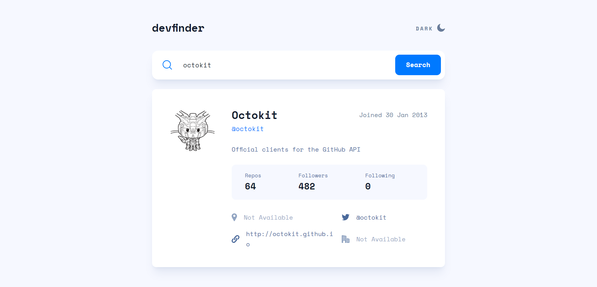
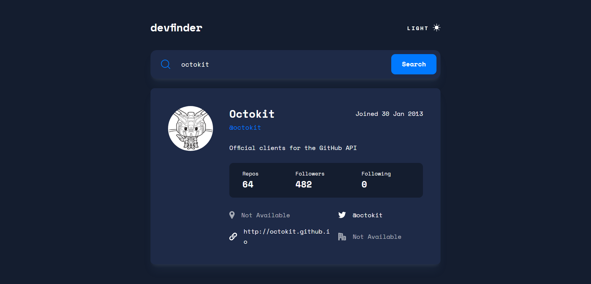
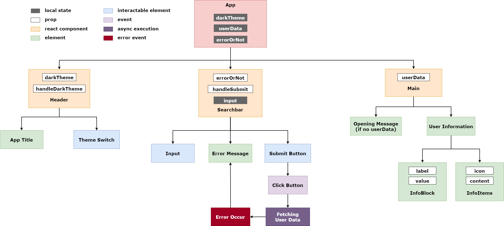

# Frontend Mentor - GitHub user search app solution

This is a solution to the [GitHub user search app challenge on Frontend Mentor](https://www.frontendmentor.io/challenges/github-user-search-app-Q09YOgaH6). Frontend Mentor challenges help you improve your coding skills by building realistic projects.

## Table of contents

- [Overview](#overview)
  - [The challenge](#the-challenge)
  - [Screenshot](#screenshot)
  - [Links](#links)
- [My process](#my-process)
  - [Built with](#built-with)
  - [Components structure](#components-structure)
  - [What I learned](#what-i-learned)
- [Author](#author)

## Overview

### The challenge

Users should be able to:

- View the optimal layout for the app depending on their device's screen size
- See hover states for all interactive elements on the page
- Search for GitHub users by their username
- See relevant user information based on their search
- Switch between light and dark themes
- <del>**Bonus**: Have the correct color scheme chosen for them based on their computer preferences. _Hint_: Research `prefers-color-scheme` in CSS.</del>

### Screenshot





### Links

- Solution URL: [Live site on Netlify](https://github-user-search-yishin.netlify.app/)
- Live Site URL: [Add live site URL here](https://your-live-site-url.com)

## My process

### Built with

- Desktop-first workflow
- Semantic HTML5 markup
- [Tailwind CSS](https://tailwindcss.com/) - CSS framework
- [React](https://reactjs.org/) - JavaScript library
- [octokit.js](https://github.com/octokit/octokit.js#octokit-api-client) - API client library

### Components structure



### What I learned

- Learned how to toggle dark mode manually with Tailwind CSS (But toggling manually and based on `prefers-color-scheme` can't be used in same time)

  **Reference:** [🔗](https://tailwindcss.com/docs/dark-mode#toggling-dark-mode-manually)

  ```js
  /** @type {import('tailwindcss').Config} */
  export default {
    darkMode: "class",
  };
  ```

  ```html
  <span className="text-darkblue dark:text-lightgrey1">
    {content ? content : "Not Available"}
  </span>
  ```

- Learned how to set environment variables in Vite

  **Reference:** [🔗](https://vitejs.dev/guide/env-and-mode.html)

  ```js
  const octokit = new Octokit({
    auth: import.meta.env.OCTOKIT_TOKEN,
  });
  ```

## Author

- Website - [Yi-Shin Jheng](https://github.com/Yishin-Jheng)
- Frontend Mentor - [@Yishin-Jheng](https://www.frontendmentor.io/profile/Yishin-Jheng)
